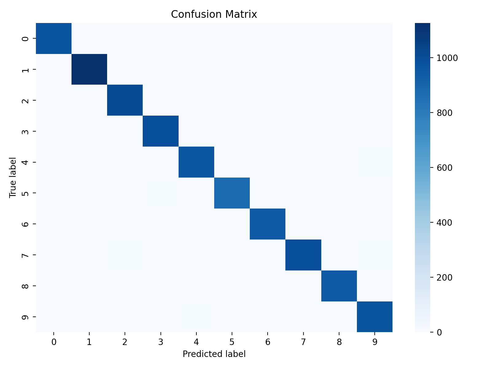
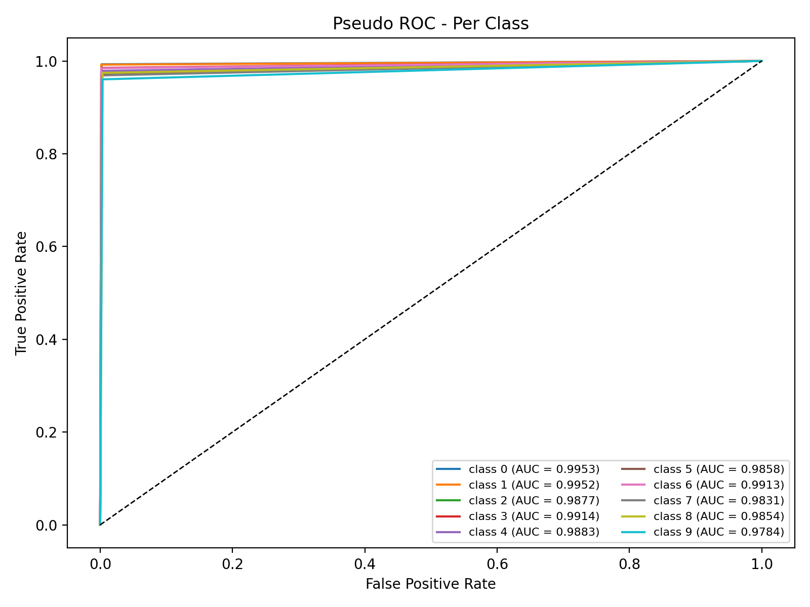
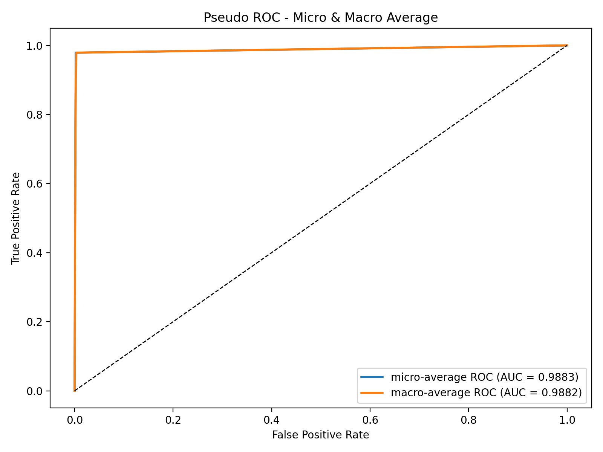

# 基于支持向量机 (SVM) 的 MNIST 手写数字识别

**代码仓库:** [https://github.com/zzyMLHW/MNISTbySVM](https://github.com/zzyMLHW/MNISTbySVM)

## 1. 核心原理：支持向量机 (SVM)

支持向量机（SVM）是一种强大的监督学习模型，其核心思想是找到一个最优的超平面，使得不同类别的样本点能被清晰分开，并且两类支持向量之间的间隔最大化。

### 1.1. 线性可分与最大间隔

对于线性可分数据，SVM 寻找形式为 $\boldsymbol{w}^{\mathrm{T}} \boldsymbol{x} + b = 0$ 的超平面。其中，$\boldsymbol{w}$ 是法向量，b 是位移项。SVM 的目标是最大化分类间隔，以获得最佳的泛化能力。

### 1.2. 软间隔与正则化

为了处理非线性可分数据，SVM 引入软间隔，允许部分样本被错误分类。其优化目标变为：

$$\min_{\boldsymbol{w},b,\xi} \frac{1}{2} \|\boldsymbol{w}\|^2 + C \sum_{i=1}^n \xi_i$$

惩罚参数 $C$ 用于权衡间隔大小和分类错误的数量。

### 1.3. 核技巧 (The Kernel Trick)

对于非线性问题，SVM 通过核技巧将数据映射到更高维的空间，使其线性可分。

本项目选用**高斯径向基函数核 (RBF Kernel)**，因为它在处理像图像特征这类复杂、非线性的高维数据时通常表现最佳。其公式为：

$$K(\boldsymbol{x}_i, \boldsymbol{x}_j) = \exp(-\gamma \|\boldsymbol{x}_i - \boldsymbol{x}_j\|^2)$$

### 1.4. 多分类策略

标准的 SVM 是二分类器。对于多分类任务，需要采用特定策略。本项目采用了**一对一 (One-vs-One, OvO)** 策略。该策略为任意两个类别构建一个二分类 SVM。对于 MNIST 的10个类别，共需要构建 $C_{10}^2=45$ 个分类器。预测时，通过所有分类器投票来决定最终类别，这也是 `libsvm` 库的默认策略。

## 2. 实验设置

* **数据集:** MNIST 手写数字数据集。
* **数据预处理:**
    1.  图像展平为 784 维特征向量。
    2.  像素值归一化至 [0, 1] 区间。
* **模型:** 支持向量机分类器 (SVC)，具体配置如下：
    * **实现库:** `libsvm`
    * **核函数:** 高斯径向基函数核 (RBF Kernel)
    * **多分类策略:** 一对一 (One-vs-One, OvO)
* **评估指标:** 准确率 (Accuracy)、微平均/宏平均 AUC、混淆矩阵 (Confusion Matrix)、ROC 曲线 (ROC Curve)。

## 3. 实验结果与分析

### 3.1. 评估指标介绍

在展示具体结果之前，首先介绍本次实验所用核心评估指标的计算方法：

* **准确率 (Accuracy):** 这是最直观的性能指标，表示被正确分类的样本数占总样本数的比例。
    $$\text{Accuracy} = \frac{\text{Number of Correct Predictions}}{\text{Total Number of Predictions}}$$

* **混淆矩阵 (Confusion Matrix):** 它是一个N×N的矩阵（N为类别数），用于可视化模型分类的详细情况。矩阵的行代表真实类别，列代表预测类别。对角线上的元素表示该类别被正确预测的数量，非对角线元素则表示被错误预测的数量。

* **ROC 曲线 和 AUC 值:**
    * **ROC 曲线 (Receiver Operating Characteristic Curve):** 它通过绘制在不同分类阈值下，**真阳性率 (TPR)** 与 **假阳性率 (FPR)** 的关系来评估分类器性能。TPR 表示真实正类中被正确预测为正类的比例，FPR 表示真实负类中被错误预测为正类的比例。曲线越靠近左上角，模型性能越好。
    * **AUC (Area Under the Curve):** 指的是 ROC 曲线下方的面积。AUC 值介于0和1之间，越接近1表示分类器性能越好。一个随机猜测的模型 AUC 值为0.5。
    * **宏平均 (Macro-average) AUC:** 独立计算每个类别的 AUC 值，然后取算术平均。该方法平等对待每个类别，无论其样本数量多少。
    * **微平均 (Micro-average) AUC:** 将所有类别的预测结果汇总在一起，计算总体的 TPR 和 FPR，然后绘制 ROC 曲线并计算 AUC。该方法平等对待每个样本。

### 3.2. 总体性能指标

| 指标 (Metric)                      | 值 (Value)   |
| :--------------------------------- | :----------- |
| 验证集准确率 (Validation Accuracy) | 0.9770       |
| **测试集准确率 (Test Accuracy)** | **0.9789** |
| 微平均 AUC (Micro-average AUC)     | 0.9883       |
| **宏平均 AUC (Macro-average AUC)** | **0.9882** |

**分析:** 模型在测试集上达到了 **97.89%** 的高准确率，且宏平均 AUC 值为 **0.9882**，表明模型在所有类别上都具有卓越且均衡的分类性能和泛化能力。

### 3.3. 各类别 AUC 表现

| 类别 (Class) | AUC 值 | 类别 (Class) | AUC 值 |
| :------------- | :------- | :------------- | :------- |
| **0** | 0.9953   | **5** | 0.9858   |
| **1** | 0.9952   | **6** | 0.9913   |
| **2** | 0.9877   | **7** | 0.9831   |
| **3** | 0.9914   | **8** | 0.9854   |
| **4** | 0.9883   | **9** | 0.9784   |

**分析:** 所有类别的 AUC 值均高于 0.978，其中结构相对简单的数字 "0" 和 "1" 识别效果最好 (AUC > 0.995)，证明了模型强大的特征分辨能力。

### 3.4. 混淆矩阵

混淆矩阵直观地验证了模型的高准确性。绝大多数预测值都集中在颜色非常深的主对角线上，这表明模型为每个数字类别都做出了大量的正确预测。与之形成鲜明对比的是，非对角线区域的颜色非常浅，说明模型极少将一个数字错误地分类为另一个，混淆度很低。这张图有力地佐证了模型高达 97.89% 的准确率，证明其具有出色的分类能力。

### 3.5 ROC曲线

*各类别的 ROC 曲线*

*微平均与宏平均 ROC 曲线*

ROC 曲线和高 AUC 值有力地证明了模型是一个高性能且鲁棒的分类器。如图3所示，所有10个类别的 ROC 曲线都非常贴近左上角，量化的 AUC 值也都高于 0.978，这表示模型在区分每一个类别时，都能在保持极高真阳性率的同时，维持极低的假阳性率。此外，如图4所示，微平均和宏平均 ROC 曲线同样紧贴左上角，其 AUC 值（0.9883 和 0.9882）高度一致，表明模型在不同类别上的表现非常均衡，不存在偏袒某个或忽略某个类别的情况。

## 4. 总结

本次实验成功应用支持向量机算法解决了 MNIST 手写数字识别问题。通过采用 **RBF 核**处理高维非线性数据，并结合**一对一**多分类策略，模型在测试集上实现了 **97.89%** 的准确率和 **0.9882** 的宏平均 AUC。结果充分证明，SVM 是一种解决此类图像分类问题的经典且高效的机器学习算法。